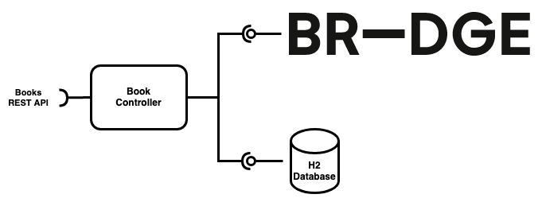

# Book Service Technical Task

As part of the BR-DGE technical interview for Java developers we have our
candidates review a simple Java Book store application which serves a REST API.
Users can search for books and create orders via the API, which involves
querying an H2 database and calling BR-DGE REST API respectively.

The service has some automated tests that are unfortunately failing. The task
is to get those tests passing again, while also providing feedback on the
code in general. Are there any issues or potential for improvements you can
identify?



## Build

```shell
./gradlew build
```

## Run

```shell
./gradlew bootRun
```
